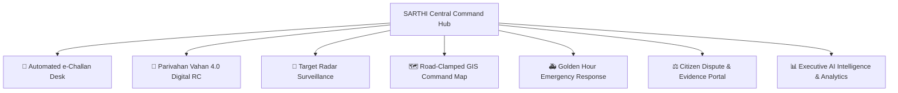
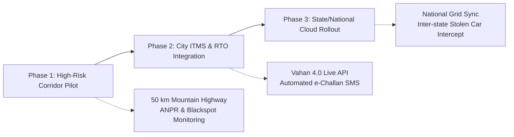

<div align="center">

# 🇮🇳 SARTHI (सारथी) 2.5
### **AI-Powered Intelligent Road Safety, Traffic Intelligence & e-Challan Infrastructure Platform**
*Aligned with the Ministry of Road Transport & Highways (MoRTH) & Digital India Initiative*

# DEPLOYED PROTOTYPE 
https://eclectic-gnome-1e57b3.netlify.app

[](LICENSE)
[](https://reactjs.org/)
[](https://www.typescriptlang.org/)
[](https://vitejs.dev/)
[](https://tailwindcss.com/)
[]()
[]()
[-red)]()

---

> **“Detect Faster. Respond Smarter. Save Lives.”**  
> *“सत्यमेव जयते — सुरक्षित सड़क, सुरक्षित भारत”*

</div>

---

## 🏛️ Executive Project Overview

**SARTHI (सारथी)** is a next-generation, national-grade Intelligent Transportation & Highway Enforcement Platform engineered to modernize traffic monitoring, automated violation enforcement, emergency response management, and citizen grievance redressal across India's state and national highway networks.

Developed as a **Student Innovation & Research Prototype by Team Tech4ALL (Graphic Era Hill University, Bhimtal)**, SARTHI bridges the critical technological gap between edge computer vision, geospatial intelligence (GIS), and government enterprise databases (Parivahan Vahan 4.0, CCTNS, FASTag NETC, and ERSS-112).

---

## 👥 Innovation Team & Institutional Credentials

| Entity | Details |
| :--- | :--- |
| **Project Name** | **SARTHI (सारथी)** — Version 2.5 (National Government Edition) |
| **Innovation Team** | **Team Tech4ALL** (5 Student Developers) |
| **Team Leader** | **Ujjwal Chaudhary** |
| **Institution** | **Graphic Era Hill University (GEHU), Bhimtal Campus** |
| **Contact Email** | [ujjwalchaudhary2007@gmail.com](mailto:ujjwalchaudhary2007@gmail.com) |
| **Contact Phone** | `+91 8868059861` |
| **Target Deployment** | MoRTH, NHAI, State Traffic Police Departments, Smart City ITMS, State Road Transport Authorities |
| **GitHub Repository** | [https://github.com/ujjwalchaudharyyy/SARTHI](https://github.com/ujjwalchaudharyyy/SARTHI) |

---

## 🚨 The Critical Problem We Solve

India accounts for over **1.5 lakh road fatalities annually**, with high-risk mountain corridors and expressways facing severe challenges:
1. **Delayed Golden Hour Response**: Emergency medical services often take 35+ minutes to locate accidents on winding highway stretches.
2. **Manual & Fragmented Enforcement**: Paper or semi-manual challaning lacks real-time vehicle registry cross-referencing and instant photographic evidence.
3. **Fake/Ghost Plates & Stolen Vehicles**: Lack of instant highway checkpoint sync allows stolen vehicles to pass undetected.
4. **Citizen Dispute Overhead**: Legitimate citizen grievances (e.g. medical emergency during red-light jump or cloned number plates) clog RTO desks without transparent digital evidence portals.

SARTHI solves these challenges with a unified, real-time command cockpit designed for high-stress operations.

---

## ✨ Core Pillars & Functional Capabilities



### 1. 👮 Traffic Officer e-Challan Generation Desk
* **Motor Vehicles (Amendment) Act Compliance**: Native integration of Indian legal sections:
  * **Sec 112/183**: Over-speeding & Dangerous Driving (₹1,000 – ₹4,000)
  * **Sec 184**: Dangerous/Reckless Driving (₹5,000)
  * **Sec 185**: Driving under influence (₹10,000 + Court Summon)
  * **Sec 194B**: Seatbelt Violation (₹1,000)
  * **Sec 194D**: Helmet Violation / Triple Riding (₹1,000 + 3 Mo Suspension)
* **Instant Digital Evidence**: ANPR photographic snapshot attachment, GPS coordinate stamp, and automated penalty computation.
* **Citizen SMS Dispatch & Printable Receipt**: Generates formal MoRTH/State Police Notice with QR payment link.

### 2. 🚗 Parivahan Vahan 4.0 Digital Smart Card RC Lookup
* Search any Indian registration number (e.g., `UK04AB1234`, `DL01CA9988`, `UP32EA7711`).
* Renders an authentic **Parivahan / DigiLocker style Digital RC Smart Card** showing:
  * Owner Name, Masked Aadhaar/Mobile, Vehicle Class, Fuel/BS Norms, Engine & Chassis Number.
  * Insurance Validity, PUCC Status, Fitness Expiry, and National Permit validation.
  * Lifetime e-Challan Ledger with payment status and pending court warrants.

### 3. 🎯 High-Speed Surveillance Radar & Live Target Tracing
* **Real-Time Highway Intercept**: Tracks high-risk, blacklisted, or stolen vehicles.
* **Telemetry HUD**: Live speed gauge, heading angle, last detected ANPR camera, and distance to state borders.
* **Checkpoint ETA Prediction**: AI predictive trajectory forecasting arrival time at upcoming toll plazas.
* **1-Click Police Cruiser Intercept Alert**: Broadcasts vehicle profile directly to patrolling highway interceptor units.

### 4. 🗺️ 100% Road-Clamped GIS Command Map
* Live multi-vehicle simulation strictly clamped to actual mountain highway geometries (Nainital, Haldwani, Almora, Bhimtal, Bhowali).
* **Zero Out-of-Road Drift**: High-precision coordinate interpolation ensures smooth, realistic vehicle movement.
* Real-time road status overlays (Blackspots, Landslide Warnings, Active Speed Cameras, Congestion Heatmaps).

### 5. ⚖️ Citizen Challan Dispute & Grievance Redressal Portal
* Empowers citizens to digitally appeal incorrect challans (e.g., medical emergency, cloned number plate, vehicle already sold).
* Upload supporting evidence (Hospital Admission Slip, FIR Copy, Sale Receipt).
* Officer review dashboard with 1-click **Approve (Waive Penalty)** or **Reject with Reason** workflow.

### 6. 🚑 Golden Hour Emergency Response & Green Corridors
* Automated nearest 108 Ambulance / Police interceptor dispatch.
* Dynamic **Traffic Signal Pre-emption (Green Corridor)** for critical patient transit.
* Live hospital bed & trauma center readiness tracker.

### 7. 🇮🇳 Bilingual Interface & Dual NIC Theme
* **Dual Theme Engine**: Official NIC/Digital India White Light Theme (default) + Dark Command Room HUD with instant toggle.
* **Full Bilingual Support**: 100% dynamic localization in **English** and **हिन्दी (Hindi)**.
* **Interactive 3D Highway Canvas**: Perspective node and grid depth background designed for government presentation displays.
* **100% Mobile Responsive**: Dedicated mobile drawer navigation and touch-optimized action cards.

---

## 🛠️ Technology Stack & Architecture

| Layer | Technologies Used |
| :--- | :--- |
| **Frontend Framework** | **React 18** (TypeScript, Hooks, Context API) |
| **Build Tool & Bundler** | **Vite 5** (Lightning-fast HMR & optimized production tree-shaking) |
| **Styling & Design System** | **Tailwind CSS**, Lucide React, Custom NIC Enterprise Color Palette |
| **Geospatial & Mapping** | **Leaflet.js**, OpenStreetMap, Custom Vector Road Clamping Engine |
| **Graphics & 3D Effects** | HTML5 Canvas 2D/3D Perspective Engine |
| **Security & Standards** | Role-Based Access Control (RBAC), Data Sanitization, Strict Type Safety |
| **Target Interoperability** | REST APIs ready for MoRTH Parivahan Vahan/Sarathi, CCTNS, FASTag NETC |

---

## 🚀 Quick Start & Local Installation

### Prerequisites
- **Node.js**: Version 18.0.0 or higher
- **npm**: Version 9.0.0 or higher

### 1. Clone the Repository
```bash
git clone https://github.com/ujjwalchaudharyyy/SARTHI.git
cd SARTHI
```

### 2. Install Dependencies
```bash
npm install
```

### 3. Run Development Server
```bash
npm run dev
```
Open your browser and navigate to: **`http://localhost:5173`**

### 4. Build for Production
```bash
npm run build
npm run preview
```

---

## 🔐 Demo Officer Access Credentials

For official demonstration and evaluation, use the pre-configured credentials on the login screen or click **"1-Click Officer Demo Login"**:

| Field | Demo Value |
| :--- | :--- |
| **Officer Service ID** | `DEMO001` |
| **Security Password** | `demo123` |
| **Designation** | Traffic Enforcement Officer / Regional Command |
| **Department** | Ministry of Road Transport & Highways (MoRTH) |

---

## 🏛️ Government Collaboration & Pilot Deployment Plan

Team Tech4ALL is actively seeking collaboration with government bodies, state police forces, and transportation departments to deploy SARTHI in a phased pilot:



### Proposed Deliverables for Government Partners:
1. **Zero-Hardware-Lock-in**: Works seamlessly with existing CCTV and ANPR camera infrastructure.
2. **Dedicated On-Premise / MeghRaj Cloud Deployment**: Ensuring complete data sovereignty under the **DPDP Act 2023**.
3. **Custom State Language Packs**: Expandable to regional languages (Tamil, Telugu, Marathi, Bengali, etc.).

---

## 📄 Compliance & Data Protection
- **Digital Personal Data Protection (DPDP) Act 2023**: Masked citizen PII in all public displays.
- **Role-Based Access Control (RBAC)**: Multi-tier officer permission levels (Constable, Inspector, RTO Officer, Super Admin).
- **Tamper-Evident Audit Logs**: Cryptographic timestamping of all issued e-challans and evidence uploads.

---

## 📬 Contact for Official Presentations & MoUs

For live demonstrations, presentations, or collaboration proposals:

* **Team Lead**: Ujjwal Chaudhary
* **Institution**: Graphic Era Hill University (GEHU), Bhimtal Campus, Uttarakhand
* **Email**: [ujjwalchaudhary2007@gmail.com](mailto:ujjwalchaudhary2007@gmail.com)
* **Phone / WhatsApp**: `+91 8868059861`
* **GitHub**: [https://github.com/ujjwalchaudharyyy](https://github.com/ujjwalchaudharyyy)

---

<div align="center">

**Developed with Pride for a Safer India 🇮🇳 by Team Tech4ALL**  
*Graphic Era Hill University, Bhimtal*

</div>

# prototype 

